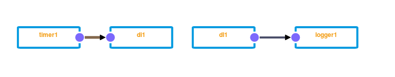

# Drools component integration

This module allows a more tight integration with Kura and its APIs.

## Session

It is possible to create a new "factory component" of the type `DroolsInstance`, which creates a
new instance of a `KieSession` and exports this as an OSGi service. This will parse the Drools rules
provided and set up the session as required by the Kura OSGi container. For referencing the user must
assign a "session ID", which can be used by other components to reference this session.

Sessions can also be exported to OSGi using different means. For example would it be possible to
develop your own service and bundle and export your own `KieSession`, based (or not) on the
core Drools bundle for Kura. It is recommended though to assign the property `drools.session.id` to
the exported service so that it does integrate with the other functionalities, like the Drools write component.

## Wires

The "Drools wire component" allows to integrate "Kura Wires" with the "Drools sessions". The Drools wire
component have a property called `session.id`, which references the session instance.

Incoming events will be inserted into the session and all rules will be fired. The type of the fact is `org.eclipse.kura.wire.WireEnvelope` (see [WireEnvelope.java](https://github.com/eclipse/kura/blob/develop/kura/org.eclipse.kura.api/src/main/java/org/eclipse/kura/wire/WireEnvelope.java)).

A simple example for dumping events would be:

~~~
package foo.bar

import org.eclipse.kura.wire.WireEnvelope
import org.eclipse.kura.wire.WireRecord
import org.eclipse.kura.type.TypedValue
import org.drools.core.factmodel.Fact

global de.dentrassi.kura.addons.drools.component.wires.DroolsWirePublisher wire

declare WireEnvelope
    @role( event )
end

declare WireRecord
    @role( event )
end

declare Heartbeat
    @role( event )
end

rule "Dump"
    dialect "mvel"
  when
      we : WireEnvelope()
  then
      System.out.println( we );
end

rule "Open Envelope"
    dialect "java"
  when
    envelope : WireEnvelope()
    record : WireRecord() from envelope.getRecords()
  then
    insert(record);
end

rule "Test"
    dialect "java"
  when
    record : WireRecord()
    typedValue : TypedValue( ((value/1000)%2) == 0 ) from record.getProperties().get("TIMER")
  then
    insert(new Heartbeat());
end

rule "Trigger heartbeat"
    dialect "mvel"
  when
    h: Heartbeat()
  then
    wire.publish("HEARTBEAT", true);
end
~~~

You can then set up a wire graph like this:

Where `di1` is a "Drools Insert" component and `dl1` is a "Drools Listen" component. Both referencing the
Drools session id you configured. The field *Global Name* of the "Drools Listen" component also needs to be set
to the global variable name from the example above: `wire`.